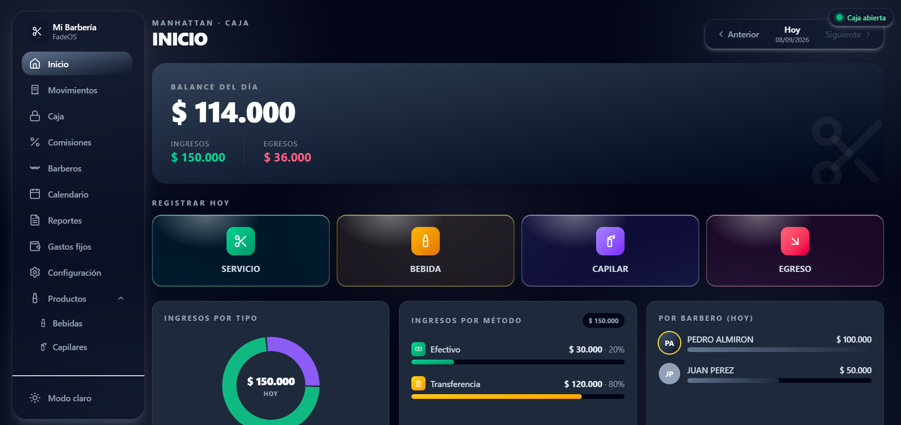
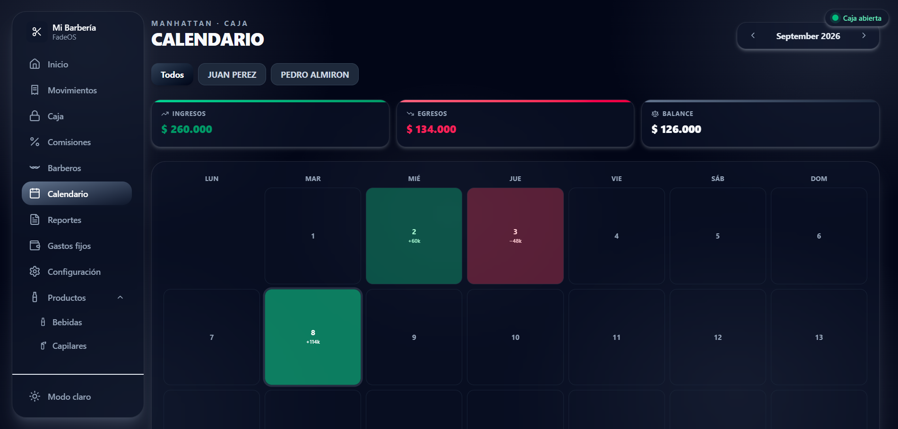
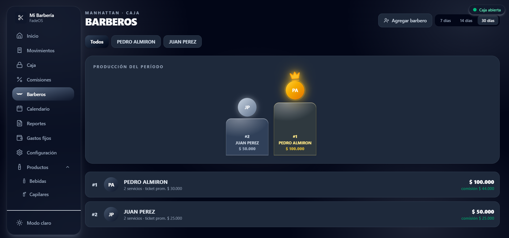
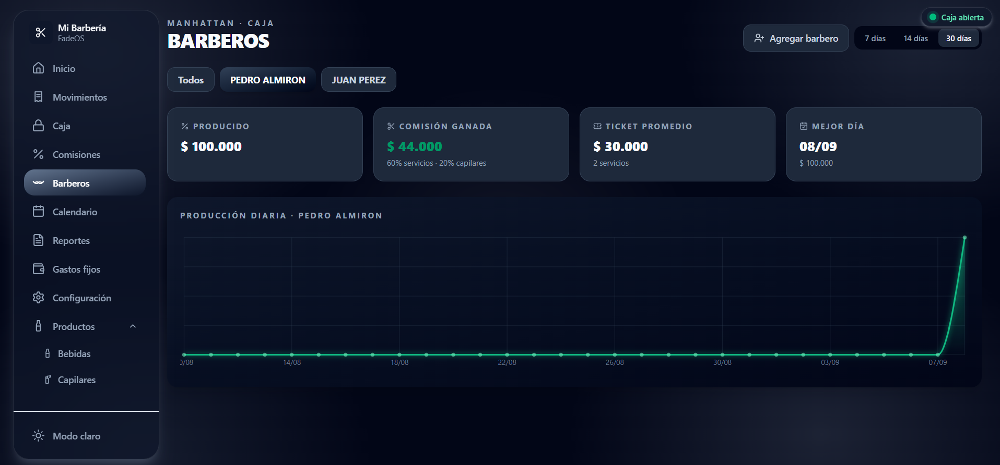
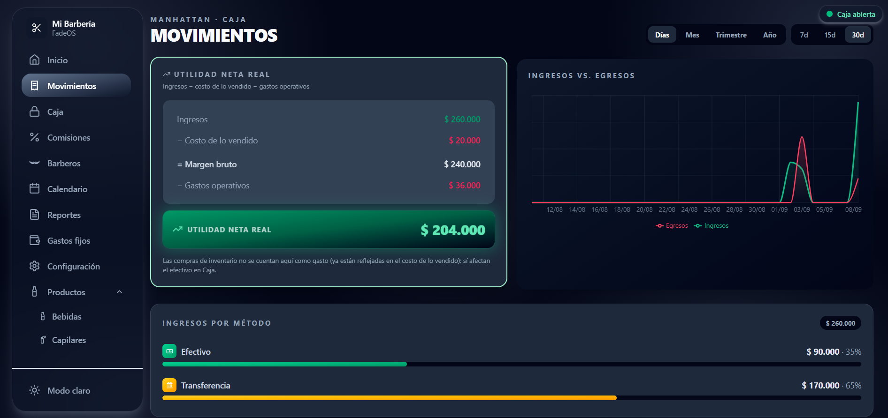

# FadeOS 💈

Una barberia llevaba las cuentas del negocio en un cuaderno y en excel separados y excesivamente rudimentario y ordinario. FadeOS es el sistema que construí para reemplazarlo: control de caja diario, comisiones automáticas por barbero, inventario, gastos fijos y reportes en tiempo real funcionando ya en un negocio real. MANHATTAN BARBERSHOP


> Proyecto de portafolio full-stack. Blanco (white-label): cada barbería puede personalizar su nombre y logo.







## ✨ Funcionalidades

- **Caja diaria**: apertura/cierre de caja, registro de ingresos y egresos por método de pago (efectivo, Nequi, tarjeta, transferencia).
- **Comisiones automáticas**: cálculo semanal (lunes-sábado) + domingo aparte, por barbero, según su % individual, con reglas distintas para servicios, productos capilares y propinas (100%).
- **Retiros y consumos de barbero**: control de adelantos de caja y consumos de inventario, descontados automáticamente de su próximo pago.
- **Inventario**: control de stock de bebidas y productos capilares, con reposición y costeo automático.
- **Gastos fijos**: arriendo, sueldos, servicios — con seguimiento de vencimientos y comparación contra ingresos.
- **Reportes y analítica**: utilidad neta real (ingresos − costo de lo vendido − gastos operativos), calendario tipo mapa de calor, comparación contra períodos anteriores.
- **Multi-dispositivo**: accesible desde celular en la misma red WiFi del negocio.
- **Modo oscuro**, diseño responsive, animaciones cuidadas.

## 🛠️ Stack técnico

**Frontend:** React 19, Vite, Tailwind CSS v4, Recharts, dayjs
**Backend:** Node.js, Express, Prisma ORM, SQLite
**Validación:** Zod

## 🧩 Retos técnicos resueltos

- Empaquetado del backend en un único archivo (esbuild) para desplegarlo en la computadora del negocio sin dejar el código fuente expuesto.
- Acceso multi-dispositivo dentro de la red local del negocio (detección automática de IP, CORS, resolución de host dinámica).
- Cálculo de comisiones con reglas de negocio distintas por tipo de ingreso (servicios, productos, propinas) y descuentos automáticos por deudas del barbero.

## 🚀 Cómo correrlo localmente

```bash
# Backend
cd backend
npm install
cp .env.example .env
npx prisma migrate dev
npm run dev

# Frontend (en otra terminal)
cd frontend
npm install
npm run dev
```
La app queda disponible en http://localhost:5173

## 📄 Licencia

Todos los derechos reservados. Proyecto de portafolio — código no disponible para uso, copia o distribución sin autorización expresa del autor.
